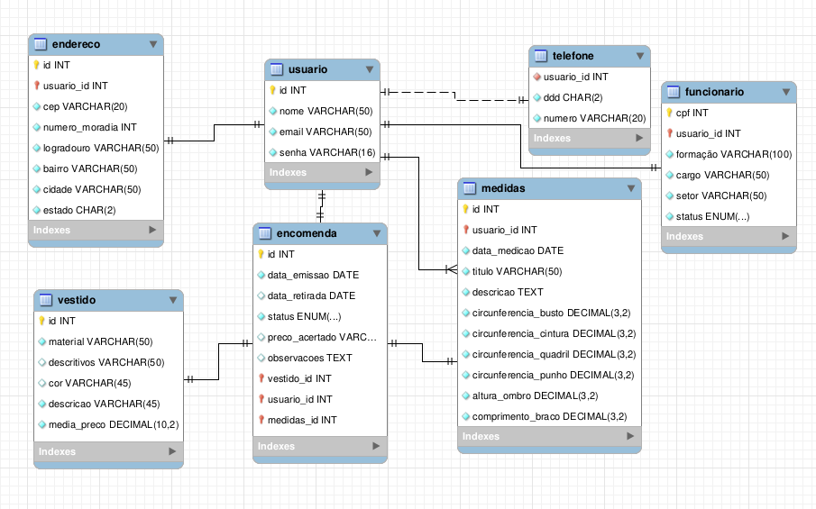

# Belíssima

## Problematização

### Descrição do Projeto
Belíssima, uma loja fictícia de vestidos sob encomenda, precisa de um meio para organizar seus pedidos. O projeto é desenvolvido para a disciplina de Projeto Integrador III, a fim de promover a divulgação e incentivo da pequena empresa, fortalecendo o setor econômico da região onde ela está localizada: Joinville e periféricos. Baseada em duas interfaces, o sistema direciona para o cliente uma de amostragem, de busca e de seleção. Para o funcionário, ela deve ser de controle dos vestidos, dos clientes e dos pedidos.

### Situação Problema
A loja fictícia precisa de um sistema capaz de listar os produtos a serem encomendados para o usuário e servir como instrumento de gestão simples para funcionários sem experiência na área administrativa e/ou logística. Nas páginas iniciais do site, os vestidos são expostos aos clientes para que estes selecionem aqueles que mais os agradam, customizando a cor e selecionando suas medidas corporais. O usuário-cliente terá, em sua página de perfil, local para cadastrar as medidas corporais, além das informações pessoais e dos itens encomendados na loja. Para o usuário-funcionário, os vestidos encomendados por todos os usuários serão expostos conforme os dias da semana em que houve alguma alteração no status da encomenda, permitindo o gerenciamento eficaz. Na mesma página, o lucro obtido é mostrado graficamente. O funcionário também tem a função de cadastro e alteração dos vestidos e de novos funcionários.

### Descrição da Proposta
A proposta é desenvolver um sistema de fácil acesso com uma parte universal para os clientes poderem analisar os vestidos em categorias ou de modo livre, uma área de exposição de cada vestido com opções de encomenda, fotos, tamanhos, etc; e uma área exclusiva aos funcionários que disponibiliza os vestidos encomendados, seu respectivo cliente e personalizações, bem como o histórico em estágios de encomendado, pronto e entregue.

## Documentação

RF001 - O sistema deve manter Usuário\
RN001 - Os dados de Usuário são: id do usuário, nome, e-mail, senha\
RN002 - Usuário pode ser Funcionário\
RN003 - Usuário pode cadastrar encomenda\
RN004 - Usuário pode excluir encomenda somente se seu status for 0\
RN005 - Usuário pode verificar informações de sua encomenda\
RN006 - Usuário pode efetuar cadastros e alterações somente se estiver com login ativo\

RF002 - O sistema deve manter Funcionário\
RN007 - Funcionário deve ser Usuário\
RN008 - Os dados adicionais de Funcionário são: id do usuário, CPF do funcionário, formação, cargo, setor, status\
RN009 - Funcionário deve ter acesso a todas as encomendas, podendo pesquisar por status, cliente e ordem cronológica de emissão\
RN010 - Funcionário pode cadastrar, alterar e excluir vestido\
RN011 - Funcionário pode mudar status e preço acertado de encomenda\

RF003 - O sistema deve manter Telefone\
RN012 - Os dados de Telefone são: id do usuário, DDD, número de telefone\
RN013 - Telefone deve ser dependente de Usuário\

RF004 - O sistema deve manter Endereço\
RN014 - Os dados do Endereço são: id do endereço, id do usuário, CEP, número da moradia, logradouro, bairro, cidade, estado\

RF005 - O sistema deve manter Vestido\
RN015 - Os dados de Vestido são: id do vestido, id material, descritivos, id cor, descrição, média de preço\

RF006 - O sistema deve manter Encomenda\
RN016 - Os dados são: id da encomenda, data de emissão, data de retirada, status, id do usuário, id do vestido, id das medidas, observações, preço acertado\

RF007 - O sistema deve manter Material\
RN017 - Os dados são: id de Material, nome\

RF008 - O sistema deve manter Cor\
RN018 - Os dados são: id de Cor, nome, código hex\

RF009 - O sistema deve manter Medidas\
RN019 - Os dados são: id de Medidas, id do usuário, data da medição, título, descrição, circunferência do busto, circunferência da cintura,circunferência do quadril, circunferência do punho, altura do ombro, comprimento do braço (semi envergado)\

RNF001 - O sistema deve ser responsivo\
RNF002 - O front-end deve ser desenvolvido em VueJS\
RNF003 - O back-end deve ser desenvolvido em Django\
RNF004 - O sistema deve ter uma Progressive Web App\

## Modelagem

## Alunos
- [Ester dos Santos Antunes](https://github.com/antuneseds)
- [Renata da Silva de Lima](https://github.com/ReehLimas)
- [Ruama Bernardes Raich](https://github.com/bernardesraischruama)
- [Vinícius Rech](https://github.com/ViniRech)
- [Vitória Fernanda Nicolau Padilha](https://github.com/fernandapadilha)
  
## Turma
- 3INFO1

## Professores
- [Eduardo da Silva](https://github.com/eduardo-da-silva)
- [Marco Andre Lopes Mendes](https://github.com/marrcandre)

## Projetos
- Front-End: [Repositório](https://github.com/projeto-belissima/front-end.git) e [Publicação](https://front-end-pi-ten.vercel.app/)
- Back-End: [Repositório](https://github.com/projeto-belissima/back-end.git) e [Publicação](https://belissima-deoi.onrender.com/)
- [Documentação](https://github.com/projeto-belissima/documentacao.git)
