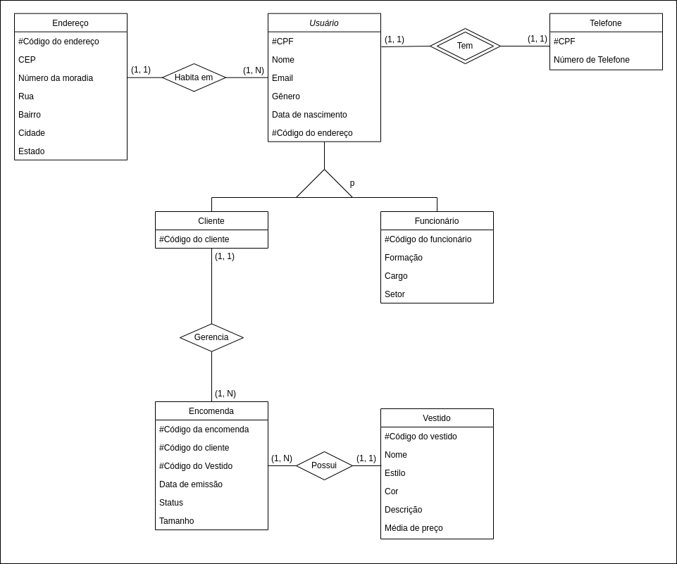

# Belíssima

## Problematização

### Descrição do Projeto
Belíssima, uma loja fictícia de vestidos sob encomenda, precisa de um meio para organizar seus pedidos. O projeto é desenvolvido para a disciplina de Projeto Integrador III, a fim de promover a divulgação e incentivo da pequena empresa, fortalecendo o setor econômico da região onde ela está localizada: Joinville e periféricos. 

### Situação Problema
A loja precisa de um sistema capaz de listar os produtos a serem encomendados para o usuário e servir como instrumento de gestão simples para funcionários sem experiência na área administrativa e/ou logística.

### Descrição da Proposta
A proposta é desenvolver um sistema de fácil acesso com uma parte universal para os clientes poderem analisar os vestidos em categorias ou de modo livre, uma área de exposição de cada vestido com opções de encomenda, fotos, tamanhos, etc; e uma área exclusiva aos funcionários que disponibiliza os vestidos encomendados, seu respectivo cliente e personalizações, bem como o histórico em estágios de encomendado, pronto e entregue.

## Documentação

RF001 - O sistema deve manter Usuário
RN001 - Os dados de Usuário são: CPF, nome, email, telefone, gênero, nascimento, endereço
RN002 - Usuário deve ser a generalização para Cliente e Funcionário

RF002 - O sistema deve manter Cliente
RN003 - Cliente deve ser especialização parcial de Usuário
RN004 - Os dados adicionais de Cliente são: código do cliente, encomendas
RN005 - Cliente pode cadastrar e excluir encomenda
RN006 - Cliente pode verificar informações de sua encomenda

RF003 - O sistema deve manter Funcionário
RN007 - Funcionário deve ser especialização parcial de Usuário
RN008 - Os dados adicionais de Funcionário são: código do funcionário, formação, cargo e setor
RN009 - Funcionário deve ter acesso a todas as encomendas, podendo pesquisar por status, cliente e ordem cronológica de emissão
RN010 - Funcionário pode cadastrar, alterar e excluir vestido
RN011 - Funcionário pode mudar status de encomenda

RF004 - O sistema deve manter Telefone
RN012 - Telefone deve ser dependente de Usuário

RF005 - O sistema deve manter Endereço
RN013 - Os dados do Endereço são: código do endereço, CEP, número da moradia, rua, bairro, cidade, estado
RN014 - Endereço se relaciona com Usuário

RF006 - O sistema deve manter Vestido
RN015 - Os dados de Vestido são: código do vestido, nome, estilo, cor, descrição, média de preço

RF007 - O sistema deve manter Encomenda
RN016 - Os dados são: código da encomenda, data de emissão, status, cliente, vestido, tamanho

RNF001 - O sistema deve ser responsivo
RNF002 - O front-end deve ser desenvolvido em VueJS
RNF003 - O back-end deve ser desenvolvido em Django

## Modelagem

## Alunos
- [Ruama Bernardes Raich](https://github.com/bernardesraischruama)
- [Vinícius Rech](https://github.com/ViniRech)
- [Vitória Fernanda Nicolau Padilha](https://github.com/fernandapadilha)
  
## Turma
- 3INFO1

## Projetos
- [Front-End](https://github.com/projeto-belissima/front-end.git)
- [Back-End](https://github.com/projeto-belissima/back-end.git)
- [Documentação](https://github.com/projeto-belissima/documentacao.git)